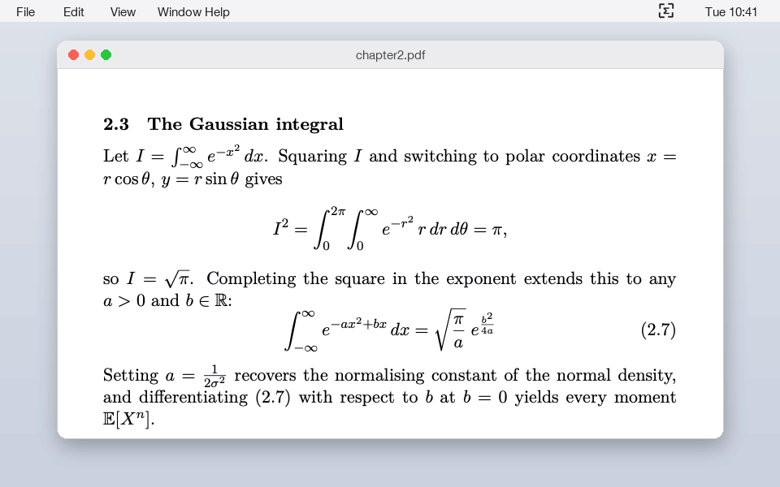
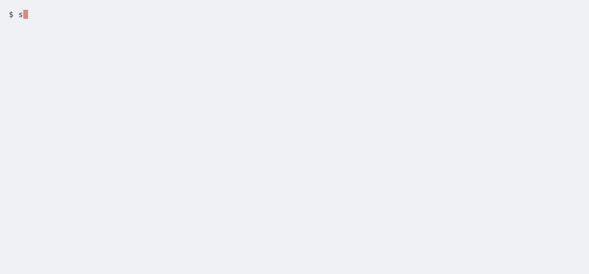

# snipmd

Press a hotkey, drag a box, get Markdown, LaTeX or a table on your clipboard. Free, offline, runs the 0.9B GLM-OCR model on your Mac.

On 48 printed equations (fractions, integrals, matrices, sums, Greek, cases), snipmd returned LaTeX that matches the source for all 48, with a median of 0.5 s from mouse release to clipboard on a MacBook Air M5.[^bench]

[](https://github.com/Arthur031221/snipmd/actions/workflows/ci.yml)
[](LICENSE)
[](https://pypi.org/project/snipmd/)



<sub>The page is a TeX render and the selection overlay is drawn, because a screen recording needs a hand on the mouse. The LaTeX and the 2.13 s in the notification are the real output of the model on that crop, recorded by `demo/record.py`.</sub>

## Why

Copying an equation out of a PDF or a lecture slide means retyping it by hand. Mathpix Snip solves this well, but the free plan stops at 10 snips a month and Pro costs $4.99 a month or $49.90 a year.[^price] Every snip also goes to their servers. LaTeX-OCR is free and local, but it only reads single equations and has not had a commit since January 2025. A 0.9B model that reads full pages, formulas and tables now fits comfortably on a laptop, so the snipping tool can run locally too.

## Install

Not on PyPI yet. Install straight from GitHub:

```sh
uv tool install git+https://github.com/Arthur031221/snipmd
```

or run it once without installing:

```sh
uvx --from git+https://github.com/Arthur031221/snipmd snipmd
```

Once published, `uvx snipmd` or `pipx install snipmd` will work the same way. On Apple Silicon this installs mlx-vlm and runs the model in process. On other machines snipmd uses [Ollama](https://ollama.com).

## Quick start

```sh
snipmd pull     # download GLM-OCR for MLX once (1.6 GB)
snipmd          # start the menu bar app
```

Press `cmd+shift+2`, drag a box around an equation, and paste. The first time, macOS asks for two permissions for your terminal: Screen Recording for the capture and Accessibility (or Input Monitoring) for the hotkey. The Snip item in the menu works without the hotkey permission.

No menu bar needed for a file:

```sh
$ snipmd demo/crop.png --mode latex
\int_{-\infty}^{\infty} e^{-a x^{2}+b x} d x=\sqrt{\frac{\pi}{a}} e^{\frac{b^{2}}{4 a}}
```

On a machine without Apple Silicon, pull the model through Ollama instead:

```sh
ollama pull glm-ocr:q8_0
snipmd page.png --backend ollama
```



## Modes

| Mode | What you get | Model prompt |
| --- | --- | --- |
| `markdown` (default) | Markdown with `$...$` and `$$...$$` math, headings, lists, tables as Markdown | `Text Recognition:` |
| `latex` | One bare equation on one line, no `$$` or `\[`, ready to paste into any math field | `Formula Recognition:` |
| `table` | Markdown table, or CSV with `snipmd config set table_format csv` | `Table Recognition:` |
| `text` | Plain text through Apple Vision, no model load (0.36 s median for the page in the GIF) | none |

Switch modes from the menu bar, with `--mode`, or with `snipmd config set mode latex`.

Output of `snipmd demo/page.png` (markdown mode) on the page in the GIF:

```markdown
2.3 The Gaussian integral

Let $I=\int_{-\infty}^{\infty} e^{-x^2} dx$. Squaring $I$ and switching to polar coordinates $x=r \cos \theta$, $y=r \sin \theta$ gives

$$I^2=\int_{0}^{2\pi} \int_{0}^{\infty} e^{-r^2} r dr d\theta=\pi,$$

so $I=\sqrt{\pi}$. Completing the square in the exponent extends this to any $a>0$ and $b \in \mathbb{R}$:

$$\int_{-\infty}^{\infty} e^{-ax^2+bx} dx=\sqrt{\frac{\pi}{a}} e^{\frac{b^2}{4a}}$$

(2.7)

Setting $a=\frac{1}{2\sigma^2}$ recovers the normalising constant of the normal density, and differentiating (2.7) with respect to $b$ at $b=0$ yields every moment $\mathbb{E}[X^n]$.
```

## How it works

1. A global hotkey (pynput) starts `screencapture -i -x`, the crosshair selector built into macOS. Escape cancels.
2. The crop is flattened onto white, padded, and upscaled when it is small. Tight crops with glyphs touching the edge read worse without the padding.
3. [GLM-OCR](https://huggingface.co/zai-org/GLM-OCR) (0.9B, MIT) reads it. On Apple Silicon it runs in process through [mlx-vlm](https://github.com/Blaizzy/mlx-vlm) with the [8-bit MLX conversion](https://huggingface.co/mlx-community/GLM-OCR-8bit). The menu bar app and `snipmd serve` load it once and keep it in memory. Elsewhere the same model runs in Ollama.
4. Post-processing strips the code fences the model likes to add, turns `\[ \]` and `\( \)` into `$$` and `$`, removes the model's token spacing (`\frac {a + b}{c}` becomes `\frac{a+b}{c}`), converts HTML tables to Markdown or CSV, and collapses whitespace.
5. The result goes to the clipboard through `pbcopy`, a notification shows it, and it is appended to a local history file.

Plain text mode skips the model and uses Apple Vision (`VNRecognizeTextRequest`) through pyobjc. It is fast but does not understand math: on the page above it returns `I = VT` for $I = \sqrt{\pi}$. Set `text_engine = "model"` to use GLM-OCR for text too.

## Compared with

| | snipmd | [Mathpix Snip](https://mathpix.com/snipping-tool) | [LaTeX-OCR](https://github.com/lukas-blecher/LaTeX-OCR) | [Pix2Text](https://github.com/breezedeus/Pix2Text) | [OpenMathpix](https://github.com/JhuoW/OpenMathpix) |
| --- | --- | --- | --- | --- | --- |
| Price | Free, MIT | 10 snips a month free, Pro $4.99 a month[^price] | Free, MIT | Free, MIT | Free |
| Runs offline | Yes | No, cloud | Yes | Yes | No, calls Baidu AIStudio |
| Screen snipping | Yes, menu bar and hotkey | Yes | Yes, `latexocr` GUI | No, library and CLI | Yes, Windows build |
| Full text with inline math | Yes | Yes | No, one equation at a time | Yes | Yes |
| Tables | Markdown or CSV | Yes | No | Yes | Yes |
| Last commit | 2026 | closed source | 2025-01-18 | 2026-08 | 2026-03 |
| GitHub stars (2026-09-29) | new | n/a | 16.6k | 3.3k | 6 |

Mathpix is the most polished of these and handles handwriting, PDFs and a phone app. snipmd does not. LaTeX-OCR has a snipping GUI but a smaller model that only sees single equations. Pix2Text is a strong library with layout analysis, and a good choice if you want a Python API more than a hotkey.

## Commands

| Command | What it does |
| --- | --- |
| `snipmd` or `snipmd app` | Start the menu bar app |
| `snipmd snip [--mode M]` | Crosshair capture from the terminal, copies the result and prints it |
| `snipmd FILE [--mode M] [--copy]` | OCR an image file to stdout. `-` reads image bytes from stdin |
| `snipmd serve [--port 8765]` | Local HTTP API, keeps the model loaded |
| `snipmd history [-n 20] [--show ID] [--copy ID] [--clear]` | Past snips |
| `snipmd config [show\|get\|set\|reset\|path]` | Settings |
| `snipmd doctor` | Check backends, model downloads, Apple Vision and the clipboard |
| `snipmd pull [--backend mlx\|ollama]` | Download the model before the first snip |

Every command takes `--help`. `snip`, `ocr`, `history`, `config` and `doctor` take `--json`. `snip` and `ocr` take `--backend mlx|ollama|auto`, `--preview` to open a local KaTeX preview page, and `--no-history`.

A one-shot CLI call loads the model each time, which takes several seconds. For repeated use, keep the menu bar app or `snipmd serve` running.

### Settings

Stored in `~/Library/Application Support/snipmd/config.toml` (or `$SNIPMD_HOME`). Change them with `snipmd config set KEY VALUE`.

| Key | Default | Meaning |
| --- | --- | --- |
| `mode` | `markdown` | `markdown`, `latex`, `table` or `text` |
| `backend` | `auto` | `auto` picks MLX when its model is downloaded, then Ollama when `glm-ocr` is pulled |
| `hotkey` | `cmd+shift+2` | Modifiers `cmd`, `ctrl`, `alt`, `shift` plus one key |
| `text_engine` | `vision` | `vision` (Apple Vision) or `model` (GLM-OCR) for text mode |
| `table_format` | `markdown` | `markdown` or `csv` |
| `mlx_model` | `mlx-community/GLM-OCR-8bit` | Any MLX conversion of GLM-OCR, or a local folder |
| `ollama_model` | `glm-ocr:q8_0` | Ollama tag |
| `ollama_url` | `http://localhost:11434` | Ollama server |
| `max_tokens` | `2048` | Upper bound on output length |
| `port` | `8765` | Port for `snipmd serve` |
| `notify` | `true` | Show a notification after each snip |
| `preview` | `false` | Open the KaTeX preview after each snip |
| `history_limit` | `500` | Entries kept in history |
| `keep_images` | `true` | Keep the crop image next to each history entry |

### HTTP API

`snipmd serve` listens on 127.0.0.1 only. Requests with a browser `Origin` other than localhost are refused, so a web page cannot use it.

```sh
# OCR image bytes
curl -s --data-binary @eq.png 'http://127.0.0.1:8765/ocr?mode=latex'

# Or JSON with base64
curl -s -H 'Content-Type: application/json' \
  -d "{\"mode\": \"table\", \"image\": \"$(base64 -i table.png)\"}" http://127.0.0.1:8765/ocr

# Open the crosshair on this Mac and return what was selected
curl -s -X POST 'http://127.0.0.1:8765/snip?mode=latex'

curl -s http://127.0.0.1:8765/health
curl -s 'http://127.0.0.1:8765/history?n=5'
```

Responses are JSON: `{"text", "raw", "mode", "backend", "seconds", "id"}`. An editor binding only needs the `/snip` call and `jq -r .text`.

## Benchmark

`bench/` renders 48 equations with a real TeX engine (tectonic), runs each image through snipmd in latex mode, and scores the output. Normalisation removes whitespace, `\,`, `\left` and `\right`, and braces around a single script token. "Equivalent" additionally maps constructs that print the same: an `array` inside parentheses and `pmatrix`, `\{ array \right.` and `cases`, `^{\prime}` and `'`, `\mathrm{max}` and `\max`. The rules are in `bench/metrics.py` and tested.

| Backend | Render scale | Exact | Equivalent | CER | Median per equation |
| --- | --- | --- | --- | --- | --- |
| MLX, GLM-OCR 8-bit | 2x (Retina, 12 pt) | 38/48 | 48/48 | 8.9% | 0.91 s |
| MLX, GLM-OCR 8-bit | 1x (non-Retina, 12 pt) | 38/48 | 48/48 | 8.9% | 1.34 s |
| Ollama, glm-ocr:q8_0 | 2x | 37/48 | 47/48 | 13.1% | 2.43 s |

All 10 exact-match misses on MLX are notation choices: six matrices written as `\left(\begin{array}...` instead of `pmatrix`, one `cases`, two `f^{\prime}`, one `\mathrm{max}`. Every MLX output also parses without errors in KaTeX 0.18.9 (`node bench/katex_check.cjs`).

The Ollama build of glm-ocr (Ollama 0.34.4) does not stop at its end token and repeats its answer until the token limit. snipmd reads the stream and cuts the loop, which keeps it usable, but one answer still came back as two different copies and each snip is slower. Use MLX on a Mac.

End to end, 20 snips from PNG on disk to text on the clipboard (prepare, recognise, post-process, `pbcopy`, history write) took a median of 0.50 s, p90 0.62 s, with the model already loaded. An earlier run of the same 20 snips while another MLX job was busy on the GPU gave a median of 1.40 s, p90 2.07 s (`bench/results/latency-mlx-busy-gpu.json`). The first snip after loading is slower because kernels compile on first use. Loading the model took between 3 and 15 s across the runs, depending on what else was using the machine.[^bench]

```sh
uv run --group bench python bench/run.py accuracy --backend mlx
uv run --group bench python bench/run.py latency --backend mlx -n 20
```

## Limits and FAQ

**Handwriting.** Not measured. GLM-OCR is trained mostly on printed documents. Expect worse results on handwritten notes.

**Very small text.** Small crops are upscaled before recognition, and the 1x run above (12 pt text rasterised at 1 pixel per point) still scored 48/48. Smaller than that was not measured.

**Whole multi-column pages.** snipmd sends your crop to the model as one image. It does not run the layout analysis that the official GLM-OCR SDK uses for full documents, so a two-column page can come back in the wrong reading order. Snip one column at a time.

**Intel Macs, Linux, Windows.** MLX needs Apple Silicon. Everywhere else use `--backend ollama`. The menu bar app and crosshair capture are macOS only. `snipmd FILE` and `snipmd serve` work anywhere Python and Ollama run.

**Why is the first CLI call slow?** Each `snipmd FILE` process loads the model. The app and `snipmd serve` pay that once.

**Does anything leave my machine?** No. After `snipmd pull` downloads the weights, the model is loaded from the local Hugging Face cache without contacting the Hub. Ollama runs on localhost. History (`~/Library/Application Support/snipmd/history.jsonl` and the saved crops) stays on disk. `snipmd history --clear` deletes it, and `snipmd config set keep_images false` stops saving crops. The KaTeX preview page is bundled with the package and loads nothing from a CDN.

**Disk and memory.** The 8-bit MLX weights are 1.6 GB on disk. The Ollama `glm-ocr:q8_0` tag is also 1.6 GB.

## Related projects

- [songforge](https://github.com/Arthur031221/songforge): Another local MLX app, song generation instead of OCR, the same one-command-and-it-runs shape.
- [mlxtrace](https://github.com/Arthur031221/mlxtrace): Profiles MLX step timing if you train or fine-tune a model. snipmd is a consumer of the same MLX stack at inference time.
- [receiptwise](https://github.com/Arthur031221/receiptwise): Uses the same GLM-OCR model on a different document, a receipt instead of a snipped equation.

## Contributing

Bug reports with the image you snipped are the most useful thing you can send. See [CONTRIBUTING.md](CONTRIBUTING.md). Tests run without a model: `uv run pytest`.

## License

MIT. See [LICENSE](LICENSE). GLM-OCR is MIT licensed by Z.ai. KaTeX, bundled for the preview page, is MIT licensed by Khan Academy.

[^bench]: Method: 48 equations from `bench/equations.py` rendered with tectonic 0.17 at 12 pt, rasterised at 2 pixels per point, recognised in latex mode by `mlx-community/GLM-OCR-8bit` through mlx-vlm 0.7.4 on a MacBook Air M5 with 24 GB, macOS 26.6, 2026-09-30. "Matches" means equal after the normalisation and equivalence rules in `bench/metrics.py`. 38 of 48 were equal without the equivalence rules. Latency: 20 runs of the hotkey code path minus the drag, from a PNG on disk to `pbcopy` done, model already loaded, same machine and date. Other builds were running on the machine throughout, so the accuracy timings in particular are not from an idle system. Raw results are in `bench/results/`.

[^price]: Mathpix Snip pricing page, https://mathpix.com/pricing/snip, read 2026-09-30: Free plan 10 images and 10 PDF pages a month, Pro $4.99 a month or $49.90 billed yearly.
